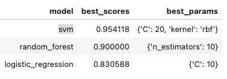
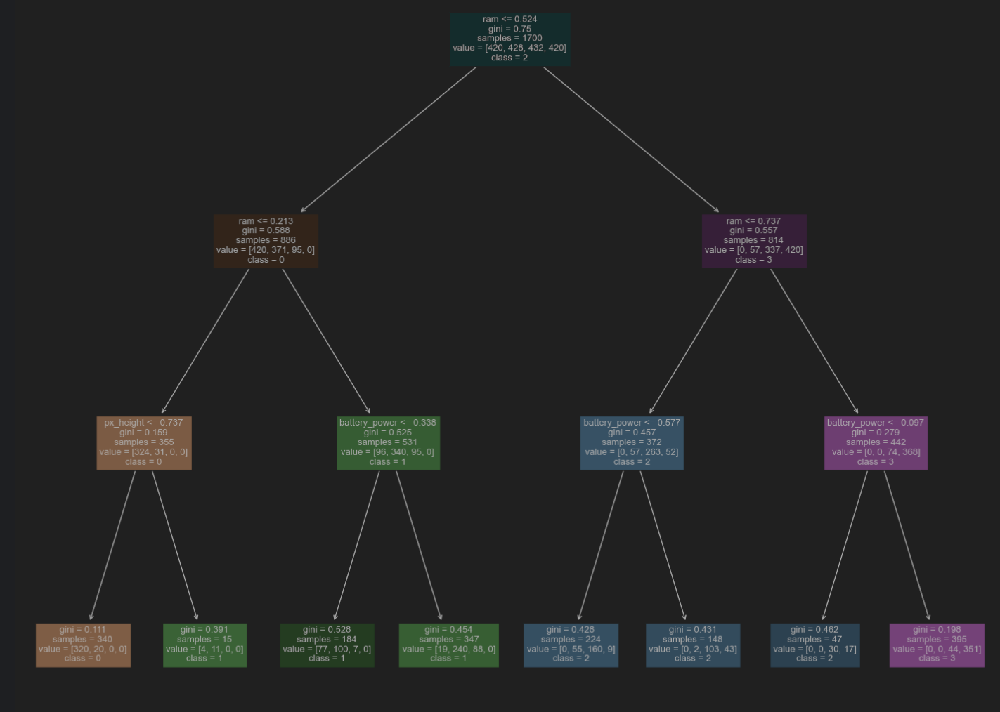
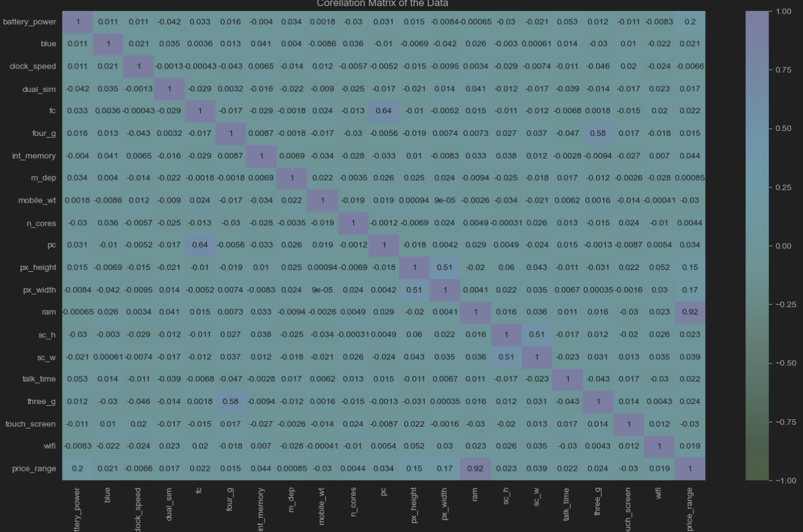
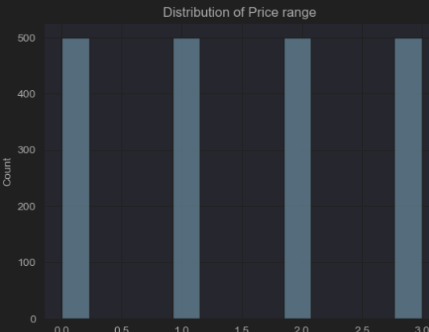
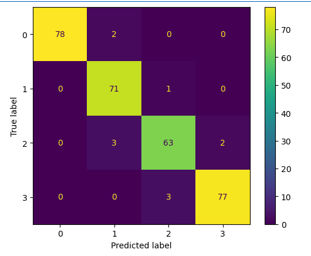
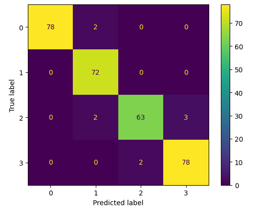
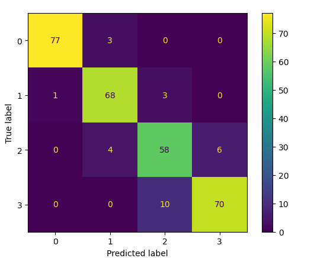

# Berkley-AI-Ml-Capstone
Using Classification to Predict a price range of a mobile phone.
Vikram Medishetty

## Executive Summary 
**Project overview and goals:** The goal of our project is to develop an ML model which can predict which of the 4  price ranges (Low, medium, high and very high cost) our given mobile falls into.
We will be training and optimizing 5 classification models to classify the price ranges based on various features of the mobile phone. Models will be able to predict any new mobile phones weather they fall within a certain range.
We will  compare the 4 models and find the best model for the results.   

**Business use case:**  As an online retailer projecting a price range before a lengthy process of questions to attract the customer to get an ballpark estimate of their phone.
This model's right predictions will give customers confidence to move forward in the process hence converting more users to sell their phones and our model helps the e-commerce company achieve this goal.

**Findings:** The best model for classifying the mobile phone price range is the Support Vector Classifier with and accuracy score of  0.954 the next best models were Gradient boost followed by Random forest and logistic regression.
This result was obtained from comparing the models scores as seen in the below image.  

Since our best model which we have based on the scores is a SVC classifier which is a blackbox model it is difficult to extract the best features of the model are not easy to retrieve.
Instead, we will use a decision tree classifier to explain which phone attributes are important for the model. The tree visualization is below.

From the above we can see that the 3 features **RAM, Pixel Height, Battery Power** features are the most important of the 20 features and the model is able to classify with a high level of confidence.
Specifically we can see that the model learned that as the RAM increases the price of the mobile increases followed by battery power increase also increase the phone price.

##  Technical Approach 

In the below section we will go through the approach we followed to gain the above results.

**Data Set:** 
The dataset we are using comes from [Kaggle](https://www.kaggle.com/datasets/iabhishekofficial/mobile-price-classification) and can be accessed here.

The dataset is a collection if 20 feature columns containing ifo about various attributes of a phone and 1 target column price_range : This is the target variable with value of 0(low cost), 1(medium cost), 2(high cost) and 3(very high cost).

There are 2000 records in the data set. 

**Exploratory Data Analysis:** The data does not contain any null or duplicate values and all the columns are numeric type. A corelation matrix was obtained to see the relation between the variable.
Which shows is that Battery power, RAM, PX height and width are the most corellated features. 

After doing a bit more exploration of the data, we arrived at the final data set to use for modelling with only the 4 most important features.
We also observed that the 3 price categories are balanced. 

## Methodology

Holdout cross validation was used to split the data into train and test sets. Further GridSearchCV was used to evaluate different parameters for the models and settled on the final best model.

## Model evaluation results
**Support Vector Classifier:** The SVC model was the best model to clasfiy the priceranges with a naccurany of 0.95. 

**Logistic regression**: Accuract of 0.83

**Random Forest:** Accuracy of .90

